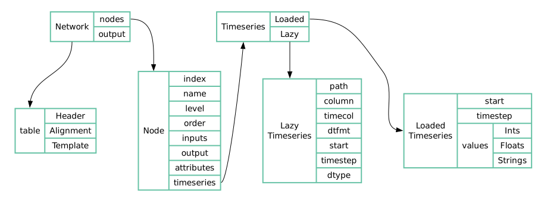

# Nadi Core Library

The Core library for the nadi-system to use as well as for the plugins to use.

The core library (=nadi_core=) will contain the core data structures
and functions/methods to interact with the data structures.

For more info go to the docs page.

# Plugins
## C Plugins using FFI

The library has the C FFI code so that you can get the shared library
(`.so`, `.dll`, `.dynlib`, etc) and the static library `.a` while
compiling the code. 

And using cbindgen it will also generate the header file `nadi_core.h`
that can be used along with the static/dynamic library to make
c-plugins or c-programs that use the nadi data types.

Use `cbindgen --cpp-compat --lang=C` to generate the header files from cbindgen.

## Rust Plugins
For Rust plugins, simply include this crate as dependencies and use it for the data structures.

Also refer to `nadi_plugin` crate for easier plugin development in rust using the provided macros.
